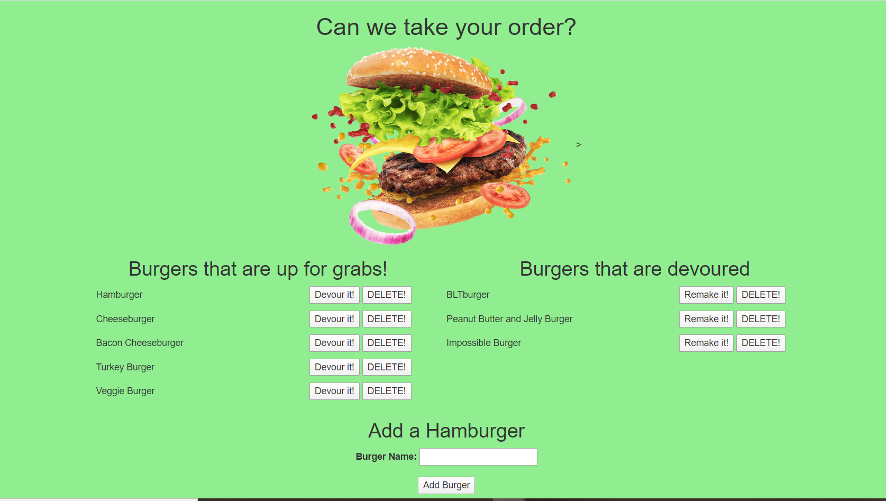

# eat_da_burger_ECB

# Unit 13 Node Express Handlebars: Eat Da Burger

In this assignment, you'll create a burger logger with MySQL, Node, Express, Handlebars and a homemade ORM (yum!). Be sure to follow the MVC design pattern; use Node and MySQL to query and route data in your app, and Handlebars to generate your HTML.

## Table of Contents

1. [Link](#link)
2. [Description](#description)
3. [Use](#use)
4. [Installation](#installation)
5. [Contributing](#contributing)
6. [Questions](#questions)

### Link

The link to the heroku app for this repo is:

```
https://let-me-take-your-order.herokuapp.com/
```

### Description

The application will be invoked with the following command:

```sh
node server.js
```

The user will be told what port the app is being served on and can go to localhost: in the web browser.

### Use

AS A user, I want to be able to write and save notes

I WANT to be able to delete notes I've written before

SO THAT I can organize my thoughts and keep track of tasks I need to complete

### Installation

Please run npm install to handle dependencies.

### Contributing

Contributions to this project are welcome.

### Questions

If you have an questions about the repo, open an issue or contact Elly Burgess directly at Eleanor.C.Burgess@gmail.com.

### Images


